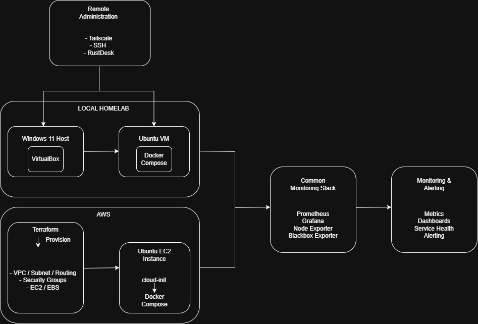
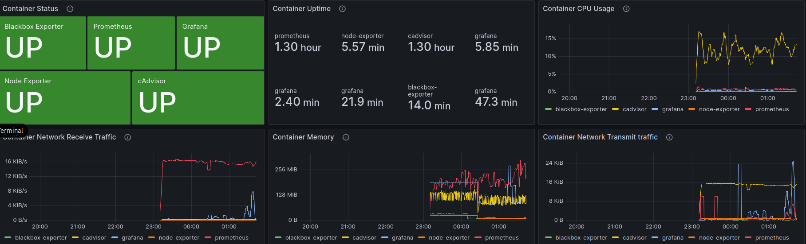

# HomeLab Monitoring Platform

**AWS · Terraform · Docker · Linux · Prometheus · Grafana · cAdvisor · GitHub Actions · CI/CD · Infrastructure as Code · Automation · Observability**

A multi-environment infrastructure monitoring and automation platform built across a local Linux HomeLab and AWS.

The project combines containerised monitoring, Infrastructure as Code, automated cloud provisioning, secure remote administration, operating-system maintenance monitoring, container observability, alerting and CI/CD automation to provide visibility into infrastructure and service health.

Originally developed as a locally hosted monitoring stack on an Ubuntu virtual machine, the platform has evolved into an AWS-deployable environment using Terraform and `cloud-init`, while retaining a common Docker-based monitoring architecture across both environments.

Development and deployment processes are supported by GitHub Actions, providing automated configuration validation and controlled deployment to the private HomeLab environment.

### Current Capabilities

* Containerised monitoring using Docker Compose
* Infrastructure and service monitoring with Prometheus
* Linux host monitoring using Node Exporter
* Network and endpoint monitoring using Blackbox Exporter
* Container-level observability using cAdvisor
* Grafana dashboards for host, network, service and container monitoring
* Per-container CPU, memory, network, uptime and availability monitoring
* Automated Grafana alerting with firing and resolved email notifications
* AWS infrastructure provisioning using Terraform
* Automated EC2 bootstrap using `cloud-init`
* Environment-specific HomeLab and AWS monitoring configurations
* Secure remote administration using Tailscale and SSH
* Automatic monitoring-stack recovery following system reboot
* Custom Prometheus operating-system maintenance metrics
* Automated CI validation using GitHub Actions
* Protected `main` branch with required CI checks
* Manual controlled deployment to the HomeLab environment
* Secure GitHub Actions deployment over Tailscale and SSH
* Post-deployment container and application health verification
* Version-controlled infrastructure and configuration

---

## Architecture

The platform uses a common Docker-based monitoring stack across both local and AWS environments.

The local HomeLab provides a persistent infrastructure environment for development, monitoring and operational testing, while Terraform can provision a separate AWS environment with the required networking, compute, storage and security configuration.

```text
                         GitHub Repository
                                │
                         GitHub Actions
                         ┌──────┴──────┐
                         │             │
                         CI            CD
                         │             │
                  Configuration     Tailscale
                   Validation           │
                                       SSH
                                        │
                                        ▼
                              Ubuntu HomeLab VM
                                        │
                                  Docker Compose
                                        │
             ┌──────────────────────────┼──────────────────────────┐
             │                          │                          │
         Prometheus                  Grafana                   Exporters
             │                                                     │
             │                                      ┌──────────────┼──────────────┐
             │                                      │              │              │
             │                                Node Exporter   Blackbox       cAdvisor
             │                                                  Exporter
             │
             └──────────────── Metrics Collection ─────────────────┘
```



---

## Core Monitoring Stack

The monitoring platform is deployed using Docker Compose.

### Prometheus

Collects and stores infrastructure, operating-system, network, service and container metrics.

### Grafana

Provides dashboards, visualisation and alerting across monitored infrastructure and services.

### Node Exporter

Exposes Linux host metrics including:

* CPU utilisation
* memory utilisation
* disk utilisation
* network activity
* system load
* uptime

The Node Exporter textfile collector is also used to expose custom HomeLab maintenance metrics.

### Blackbox Exporter

Provides active availability and response-time monitoring for network and HTTP endpoints.

### cAdvisor

Provides container-level resource and operational metrics directly from the Docker environment.

cAdvisor exposes metrics to Prometheus for each container, including:

* CPU utilisation
* memory working-set usage
* network receive traffic
* network transmit traffic
* container start time
* container presence and availability

Docker Compose metadata exposed by cAdvisor allows metrics to be grouped by service, providing clean identification of the monitoring containers within Prometheus and Grafana.

The HomeLab currently monitors five core containers:

```text
prometheus
grafana
node-exporter
blackbox-exporter
cadvisor
```

This extends the platform from host and network monitoring into container-level observability.

---

## Infrastructure as Code — AWS & Terraform

Following the original manual AWS deployment, the cloud infrastructure was rebuilt using Terraform to provide a repeatable and version-controlled deployment process.

Terraform provisions:

* Dedicated AWS VPC
* Public subnet
* Internet Gateway
* Route table and subnet association
* Security Groups
* Individual ingress and egress rules
* EC2 compute instance
* Encrypted gp3 EBS root storage
* Configurable SSH and monitoring access
* Deployment outputs including resource identifiers and public IP information

Reusable infrastructure configuration is separated from deployment-specific values using Terraform variables.

Local deployment values are stored in:

```text
terraform.tfvars
```

which is excluded from source control.

A sanitised:

```text
terraform.tfvars.example
```

documents the required configuration without exposing local values.

Terraform state and saved plan files are also excluded from Git.

### Deployment Lifecycle

The infrastructure has been successfully tested through the complete Terraform lifecycle:

```text
terraform fmt
terraform validate
terraform plan
terraform apply
terraform destroy
```

The AWS environment was successfully created, validated and subsequently destroyed using Terraform, demonstrating that the cloud infrastructure can be treated as reproducible and disposable rather than manually maintained.

---

## Automated EC2 Bootstrap

Terraform-provisioned EC2 instances use EC2 User Data and `cloud-init` to automate initial operating-system configuration.

The version-controlled bootstrap process:

* Updates Ubuntu package repositories
* Applies available operating-system package updates
* Configures Docker's official Ubuntu repository
* Installs Docker Engine
* Installs Docker Compose
* Enables and starts Docker
* Adds the Ubuntu user to the Docker group

The process was validated against a clean Ubuntu 24.04 LTS EC2 instance.

Validation confirmed:

```text
cloud-init status : done
Docker Engine     : installed
Docker Compose    : installed
Docker service    : active
Ubuntu user       : member of docker group
```

A test container was successfully launched without `sudo`, confirming that a newly provisioned EC2 instance could automatically become a Docker-ready host without manual package installation.

---

## Multi-Environment Configuration

The project supports both the original HomeLab and AWS deployments using the same Docker Compose configuration.

Environment-specific Prometheus configurations are stored separately:

```text
prometheus/
├── homelab.yml
└── aws.yml
```

The required configuration is selected using:

```text
PROMETHEUS_CONFIG
```

### HomeLab

```text
PROMETHEUS_CONFIG=./prometheus/homelab.yml
```

The HomeLab environment monitors:

* Prometheus
* Node Exporter
* Docker containers through cAdvisor
* local router availability
* Cloudflare DNS
* Google DNS
* Internet connectivity
* network latency
* custom operating-system maintenance metrics

### AWS

```text
PROMETHEUS_CONFIG=./prometheus/aws.yml
```

The AWS environment monitors:

* Prometheus
* Node Exporter
* Grafana availability
* Prometheus availability
* external HTTP availability
* HTTP response times

Docker Compose dynamically selects the required configuration:

```yaml
- ${PROMETHEUS_CONFIG:-./prometheus/homelab.yml}:/etc/prometheus/prometheus.yml
```

This allows a common container deployment to operate across multiple environments without manually modifying the Compose file.

---

## Reliability & Maintenance Monitoring

The platform has been extended beyond basic infrastructure monitoring to include service recovery and operating-system maintenance visibility.

### Automatic Monitoring-Stack Recovery

Monitoring containers use:

```yaml
restart: unless-stopped
```

A complete Ubuntu VM reboot was performed to validate recovery.

Following restart:

* Docker started automatically
* Prometheus recovered automatically
* Grafana recovered automatically
* Node Exporter recovered automatically
* Blackbox Exporter recovered automatically
* existing Grafana dashboards remained available
* Prometheus targets returned to a healthy state

No manual `docker compose up -d` command was required.

### Operating-System Maintenance Metrics

A custom Bash script:

```text
check-updates.sh
```

collects:

* number of pending APT package upgrades
* whether the operating system requires a reboot

The script produces custom Prometheus metrics:

```text
homelab_pending_updates
homelab_reboot_required
```

through the Node Exporter textfile collector.

These metrics provide operating-system maintenance visibility directly within the existing Prometheus and Grafana monitoring stack.

---

## CI/CD Pipeline

GitHub Actions provides automated configuration assurance and controlled deployment of the HomeLab monitoring platform.

The pipeline is split into two distinct stages:

```text
Development
    │
    ▼
Feature Branch
    │
    ▼
Pull Request
    │
    ▼
GitHub Actions CI
    │
    ├── Docker Compose validation
    ├── Prometheus configuration validation
    ├── ShellCheck
    └── Terraform validation
    │
    ▼
Protected main
    │
    ▼
Manual CD Workflow
    │
    ▼
Tailscale
    │
    ▼
SSH
    │
    ▼
HomeLab VM
    │
    ▼
Docker Compose Deployment
    │
    ▼
Post-Deployment Health Verification
```

### Continuous Integration

The CI workflow is stored in:

```text
.github/workflows/ci.yml
```

and executes automatically for pushes and pull requests.

The workflow performs:

* Docker Compose configuration validation
* Prometheus configuration validation using `promtool`
* Bash static analysis using ShellCheck
* Terraform formatting checks
* Terraform initialisation without a backend
* Terraform configuration validation

The `main` branch is protected using a GitHub ruleset.

The CI `basic-check` job is required before changes can be merged, providing a configuration quality gate between development branches and the main project branch.

### Continuous Deployment

The CD workflow is stored in:

```text
.github/workflows/deploy.yml
```

Deployment is intentionally triggered manually using GitHub Actions `workflow_dispatch`.

This provides a controlled deployment process while retaining an approval point before changes are applied to the HomeLab environment.

The deployment workflow:

1. Creates an ephemeral Tailscale connection from the GitHub-hosted runner
2. Verifies connectivity to the HomeLab VM
3. Configures dedicated SSH authentication
4. Verifies the HomeLab SSH host identity using a pinned host key
5. Connects securely to the HomeLab VM
6. Retrieves the latest version of `main` using a dedicated read-only Git remote
7. Validates the live Docker Compose configuration
8. Deploys the monitoring stack using Docker Compose
9. Performs post-deployment health verification

### Secure Deployment Connectivity

The HomeLab does not expose SSH or management services directly to the public Internet for CI/CD deployment.

GitHub Actions connects through Tailscale using an OAuth client and the dedicated:

```text
tag:ci
```

identity.

Sensitive deployment credentials are stored using GitHub repository secrets, while non-secret deployment configuration is stored using repository variables.

SSH host verification is pinned rather than disabling host-key checking.

The VM also separates Git access according to purpose:

```text
origin       → SSH   → normal development and authenticated pushes
deploy-read  → HTTPS → read-only deployment updates
```

This allows the deployment workflow to retrieve the public repository without exposing the developer's normal GitHub credentials to the deployment process.

### Post-Deployment Health Verification

A successful Docker command alone does not prove that the monitoring platform is operational.

The deployment workflow therefore performs health verification after:

```text
docker compose up -d
```

The workflow verifies the expected monitoring services before checking application readiness.

The expected services are:

```text
prometheus
grafana
node-exporter
blackbox-exporter
cadvisor
```

Application readiness is then verified using:

```text
Prometheus : http://localhost:9090/-/ready
Grafana    : http://localhost:3000/api/health
```

Retry logic allows the applications time to initialise before the deployment is considered unsuccessful.

A successful deployment therefore confirms:

```text
Repository updated
        │
        ▼
Compose configuration valid
        │
        ▼
Containers deployed
        │
        ▼
Required containers running
        │
        ▼
Prometheus ready
        │
        ▼
Grafana healthy
        │
        ▼
Deployment successful
```

---

## Container Observability & Alerting

Phase 7 extended the HomeLab monitoring stack with cAdvisor to provide visibility into the Docker containers running the monitoring platform.

cAdvisor is deployed as part of the existing Docker Compose stack and exposes container metrics to Prometheus on port `8080`.

Prometheus collects these metrics using a dedicated scrape job:

```yaml
- job_name: 'cadvisor'
  static_configs:
    - targets: ['cadvisor:8080']
```

### Docker Container Monitoring Dashboard

A dedicated Grafana dashboard provides operational visibility across the five core monitoring services.

The dashboard includes:

* individual container UP/DOWN status
* container uptime
* CPU utilisation
* memory working-set usage
* network receive throughput
* network transmit throughput



The dashboard provides a single operational view of the Docker monitoring environment and allows abnormal container behaviour or service loss to be identified quickly.

### Container Availability Monitoring

Container presence is monitored using the cAdvisor metric:

```text
container_last_seen
```

Each expected Docker Compose service is evaluated independently.

The Grafana status panel presents each service as:

```text
UP    → Green
DOWN  → Red
```

Container state detection was validated through controlled service shutdown and recovery testing.

Testing confirmed the lifecycle:

```text
Container Running
      │
      ▼
Status UP
      │
      ▼
Container Stopped
      │
      ▼
cAdvisor stops reporting container
      │
      ▼
Status DOWN
      │
      ▼
Container Restarted
      │
      ▼
Status UP
```

### Docker Container Down Alert

A Grafana alert rule:

```text
Docker Container Down
```

monitors the expected services for container disappearance.

The rule uses Prometheus `absent_over_time()` queries to detect when an expected container has not been reported for two minutes.

The monitored services are:

```text
prometheus
grafana
node-exporter
blackbox-exporter
cadvisor
```

The alert is evaluated every minute, with the two-minute absence period handled directly by PromQL.

Alert notifications are routed through the existing Grafana notification policy and email contact point.

Controlled failure and recovery testing confirmed:

```text
Container Stopped
      │
      ▼
Container Status DOWN
      │
      ▼
Grafana Alert Firing
      │
      ▼
Email Notification
      │
      ▼
Container Restored
      │
      ▼
Container Status UP
      │
      ▼
Grafana Alert Resolved
      │
      ▼
Recovery Email
```

Both firing and resolved email notifications were successfully validated.

### Monitoring Dependency

The dashboard provides status visibility for all five monitoring containers.

Prometheus and Grafana, however, form part of the monitoring path itself. A complete failure of Prometheus prevents Grafana from querying its datasource, while a complete Grafana failure also removes the Grafana alerting engine.

Reliable notification of failures affecting the monitoring platform itself therefore requires an independent external monitoring path.

This is retained as a future resilience enhancement rather than masking the dependency within the existing monitoring stack.

---

## Security & Configuration Management

The project follows several configuration-management and security practices:

* sensitive credentials are excluded from source control
* GitHub Secrets are used for deployment credentials
* GitHub Variables are used for non-secret deployment configuration
* Terraform deployment values are separated from reusable infrastructure code
* Terraform state files are excluded from Git
* SSH host identity is explicitly verified during deployment
* HomeLab deployment traffic traverses the private Tailscale network
* GitHub Actions uses a dedicated Tailscale CI identity
* deployment Git access is separated from normal development access
* `main` is protected by required CI checks
* deployment is manually controlled rather than automatically triggered on every merge

---

## Project Evolution

### Phase 1 — Local Monitoring

Built the original monitoring platform on an Ubuntu HomeLab VM using Docker, Prometheus, Grafana, Node Exporter and Blackbox Exporter.

### Phase 2 — AWS Deployment

Deployed the monitoring platform manually to an AWS EC2 instance and recreated cloud-specific dashboards and monitoring targets.

### Phase 3 — Infrastructure as Code

Rebuilt the AWS infrastructure using Terraform, including networking, security and EC2 resources.

### Phase 4 — Secure Remote Administration

Introduced Tailscale and SSH to provide secure remote access to the HomeLab environment without exposing administrative services directly to the Internet.

### Phase 5 — Reliability & Maintenance

Added automatic container recovery, operating-system maintenance metrics and Grafana alerting to improve operational visibility and resilience.

### Phase 6 — CI/CD & Configuration Assurance

Introduced GitHub Actions for automated configuration validation and controlled deployment.

Continuous Integration validates Docker Compose, Prometheus, Bash and Terraform configuration before changes can pass through the protected `main` branch.

Continuous Deployment uses an ephemeral Tailscale GitHub Actions runner and dedicated SSH authentication to securely deploy the monitoring stack to the HomeLab VM.

Post-deployment verification confirms container state, Prometheus readiness and Grafana health before a deployment is considered successful.

### Phase 7 — Advanced Observability & Container Monitoring

Extended the monitoring platform from host and network monitoring into Docker container-level observability using cAdvisor.

Prometheus now collects per-container CPU, memory, network, uptime and availability metrics for the monitoring stack.

A dedicated Docker Container Monitoring dashboard provides a consolidated operational view of Prometheus, Grafana, Node Exporter, Blackbox Exporter and cAdvisor.

Container availability monitoring and a multi-service `Docker Container Down` alert were implemented and validated through controlled container failure and recovery testing.

Grafana email notifications were successfully tested for both firing and resolved alert states.

---

## Technologies

| Area | Technologies |
|---|---|
| Operating Systems | Ubuntu Linux |
| Containers | Docker, Docker Compose |
| Monitoring & Observability | Prometheus, Node Exporter, Blackbox Exporter, cAdvisor |
| Visualisation & Alerting | Grafana |
| Cloud | AWS EC2, VPC, EBS, Security Groups |
| Infrastructure as Code | Terraform |
| Bootstrap Automation | cloud-init |
| CI/CD | GitHub Actions |
| Code Quality & Validation | promtool, ShellCheck, Terraform validation |
| Secure Connectivity | Tailscale, SSH |
| Version Control | Git, GitHub |
| Scripting | Bash |

---

## Repository Structure

```text
homelab-monitoring/
├── .github/
│   └── workflows/
│       ├── ci.yml
│       └── deploy.yml
├── Terraform/
├── docs/
│   └── images/
├── prometheus/
│   ├── homelab.yml
│   └── aws.yml
├── Screenshots/
│   ├── AWS-Stack/
│   ├── container-monitoring-dashboard.png
│   ├── infrastructure-dashboard.png
│   ├── monitoring-architecture-v2.png
│   └── network-dashboard.png
├── check-updates.sh
├── docker-compose.yml
├── terraform.tfvars.example
└── README.md
```

---

## Key Learning Outcomes

This project has provided practical experience in:

* designing and operating a containerised monitoring platform
* Linux infrastructure administration
* Prometheus metrics collection and configuration
* Grafana dashboards and alerting
* Docker and Docker Compose
* implementing container-level observability using cAdvisor
* collecting and querying Docker container metrics with Prometheus
* building Grafana dashboards for per-container CPU, memory, network, uptime and availability
* using Docker Compose metadata to identify and group container metrics
* designing expected-service availability monitoring
* using PromQL `absent_over_time()` for service disappearance detection
* validating monitoring through controlled container failure and recovery testing
* implementing and testing Grafana firing and resolved email notifications
* understanding self-monitoring dependencies within an observability platform
* AWS infrastructure deployment
* Infrastructure as Code using Terraform
* automated Linux provisioning using `cloud-init`
* secure remote administration using Tailscale and SSH
* Bash scripting and custom Prometheus metrics
* Git feature-branch and pull-request workflows
* GitHub branch protection and required status checks
* building CI workflows with GitHub Actions
* validating Docker, Prometheus, Bash and Terraform configuration automatically
* implementing controlled CD to a private infrastructure environment
* managing CI/CD credentials using secrets and variables
* SSH host-key verification
* post-deployment application health verification
* troubleshooting multi-stage authentication and deployment workflows

---

## Future Development

### Phase 8 — Terraform State & Structure

Planned improvements to the Infrastructure as Code implementation include:

* remote Terraform state
* state locking where appropriate
* review and modularisation of the Terraform configuration
* improved separation and reuse of infrastructure components

### Phase 9 — Physical HomeLab Expansion

The HomeLab will be expanded beyond the current virtualised environment to include additional physical infrastructure.

Planned development includes:

* additional physical Linux nodes
* OPNsense firewall integration
* managed Ethernet switching
* VLANs and network segmentation
* multiple monitored hosts
* firewall and network infrastructure monitoring
* additional Prometheus targets

### Phase 10 — Deployment Resilience

Further CI/CD development will focus on deployment safety and recovery.

Planned enhancements include:

* GitHub deployment environments
* deployment approval gates
* rollback capability
* additional post-deployment validation
* automated testing of Prometheus rules and alerts
* improved deployment failure handling and recovery
* evaluation of automatic deployment following approved merges to `main`
* independent monitoring of the monitoring platform itself

---

## Project Status

**Phase 7 — Advanced Observability & Container Monitoring: Complete**

The platform now provides monitoring across host, network, service and container layers.

The HomeLab monitoring stack includes Prometheus, Grafana, Node Exporter, Blackbox Exporter and cAdvisor, with dedicated container-level dashboards providing CPU, memory, network, uptime and availability visibility.

Container failure detection has been validated through controlled shutdown and recovery testing, with Grafana successfully delivering both firing and resolved email notifications.

The project also retains its Terraform-based AWS infrastructure, automated EC2 provisioning, secure Tailscale administration and GitHub Actions CI/CD pipeline.

**Next Phase: Phase 8 — Terraform State & Structure**