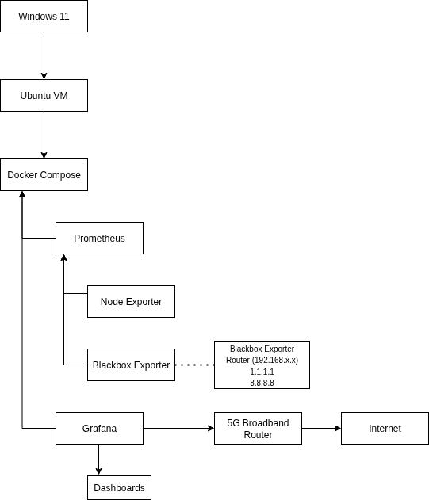
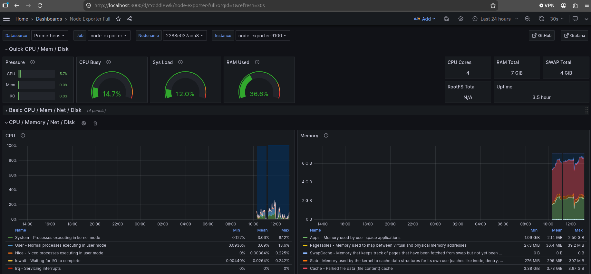
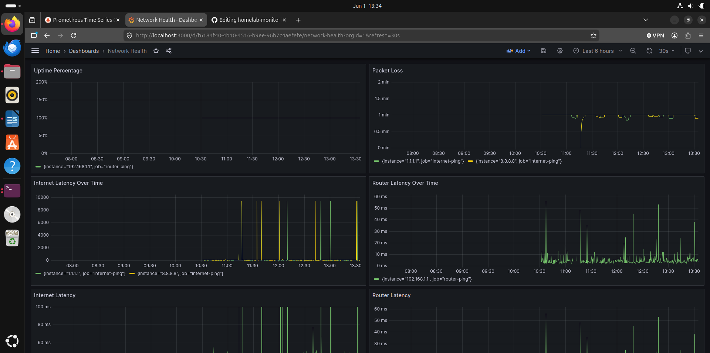

# HomeLab Monitoring Stack

## Overview

This project was created to gain hands-on experience with infrastructure monitoring, Linux administration, containerisation and observability tooling.

The monitoring stack is hosted on an Ubuntu virtual machine and deployed using Docker Compose. Prometheus is used to collect and store metrics, Grafana provides visualisation and dashboards, Node Exporter collects host-level metrics from the VM, and Blackbox Exporter is used to monitor network connectivity and latency.

The goal was to build a monitoring solution from the ground up, document the deployment process, and gain practical experience with technologies commonly used in cloud, infrastructure and DevOps environments.

## Project Objectives

* Deploy a monitoring stack using Docker Compose
* Configure Prometheus to collect infrastructure and network metrics
* Build Grafana dashboards for visualisation and analysis
* Monitor Linux system health and performance
* Monitor network availability and latency
* Manage project configuration using Git and GitHub
* Gain practical experience with Linux, Docker and observability tooling

---

## Environment

### Host Environment

* Windows 11
* Oracle VirtualBox

### Virtual Machine

* Ubuntu Desktop

### Monitoring Stack

* Prometheus
* Grafana
* Node Exporter
* Blackbox Exporter
* Docker
* Docker Compose

### Network Equipment

* Zyxel NR5103E 5G Router (Three UK 5G Home Broadband)

---

## Architecture

Windows Host
    │
Ubuntu VM
    │
Docker Compose
├── Prometheus
├── Grafana
├── Node Exporter
└── Blackbox Exporter
    │
Zyxel NR5103E Router
    │
Internet

---

## Dashboards

### Infrastructure Dashboard

The Infrastructure Dashboard uses Node Exporter metrics to provide visibility into the Ubuntu virtual machine.

Metrics include:

* CPU utilisation
* Memory utilisation
* Disk usage
* Network throughput
* System load
* System uptime

### Network Health Dashboard

The Network Health Dashboard uses Blackbox Exporter to monitor network availability and latency.

Metrics include:

* Router availability
* Internet availability
* Router response time
* Internet response time
* Historical latency trends
* Service reachability

---

## Monitoring Targets

### Infrastructure

| Target            | Purpose                                   |
| ----------------- | ----------------------------------------- |
| Ubuntu VM         | Host performance and resource utilisation |
| Docker Containers | Monitoring services running within the VM |

### Network

| Target                   | Purpose                             |
| ------------------------ | ----------------------------------- |
| Local Router             | Availability and latency monitoring |
| Cloudflare DNS (1.1.1.1) | Internet connectivity monitoring    |
| Google DNS (8.8.8.8)     | Internet connectivity monitoring    |

---

## Key Skills Demonstrated

This project provided practical experience with:

* Linux administration
* Docker container management
* Docker Compose deployment
* Prometheus configuration
* Grafana dashboard creation
* Metrics collection and analysis
* Network monitoring concepts
* Git version control
* GitHub repository management
* SSH authentication and key management
* Troubleshooting containerised applications

---

## Challenges Encountered

During the build process several issues were encountered and resolved, including:

* Docker repository configuration issues
* Docker daemon and socket troubleshooting
* Container networking conflicts
* Docker permission management
* Prometheus target configuration
* Grafana datasource connectivity issues
* GitHub SSH authentication setup

Resolving these issues provided valuable experience with troubleshooting Linux and container-based environments.

---

## Screenshots

### Infrastructure Dashboard

### Network Health Dashboard

---

## Future Improvements

Planned enhancements include:

* Implementing Alertmanager for automated alerting
* Adding cAdvisor for container-level monitoring
* Monitoring additional Linux hosts
* Monitoring web services and applications
* Building custom Grafana dashboards
* Exploring cloud deployment options within AWS

---

## Repository Structure

Monitoring/
├── docker-compose.yml
├── prometheus.yml
├── README.md
├── screenshots/
└── .gitignore

---

## Author

This project was developed as part of a personal learning programme focused on infrastructure, cloud technologies and observability tooling.
